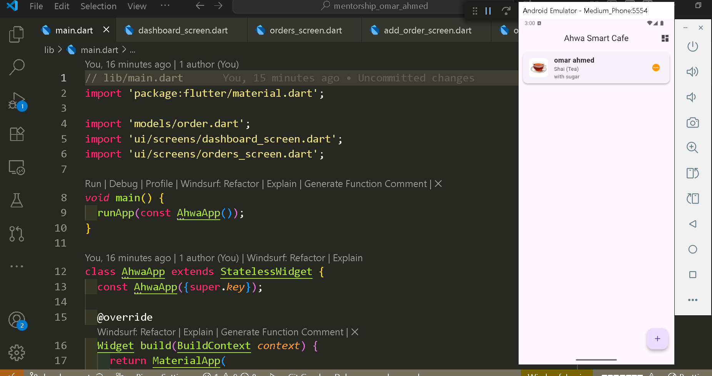
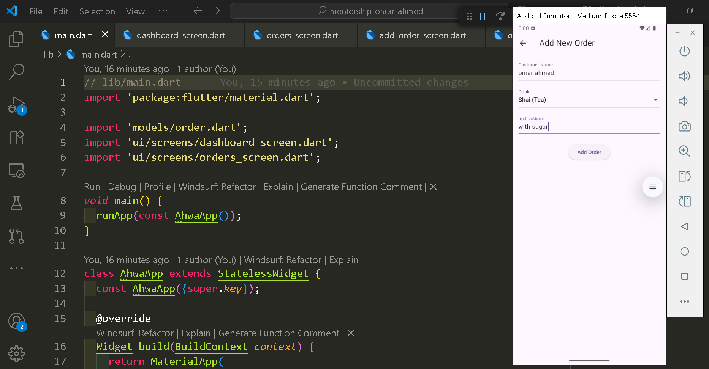
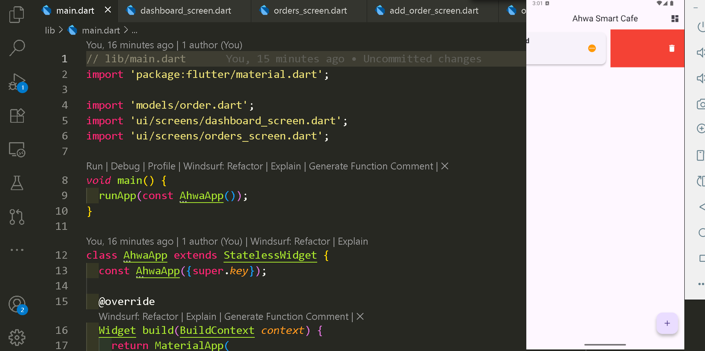

# Smart Ahwa Manager App

A Flutter application designed to help ahwa owners efficiently manage customer orders, track popular drinks, and generate daily sales statistics.

---

## Project Description

This project allows you to:  
- Add new customer orders dynamically using a form.  
- Delete orders using swipe-to-delete or a dedicated delete button.  
- View a dashboard with total orders, top-selling drinks, and current orders.  
- Display each order in a card with drink image, customer name, and instructions.  

The app is built following **OOP & SOLID principles**, ensuring modularity, encapsulation, and easy maintainability.

---

## Project Structure
lib/
├── main.dart                 # Entry point, sets up routes for Orders & Dashboard
├── models/
│   └── order.dart            # Order model + DrinkType enum with imagePath
├── ui/
│   ├── screens/
│   │   ├── orders_screen.dart       # Shows list of orders, add & delete functionality
│   │   ├── add_order_screen.dart    # Form to add new orders
│   │   └── dashboard_screen.dart    # Shows order statistics and top-selling drinks
│   └── widgets/
│       └── order_card.dart          # Card widget for each order with image & delete button
├── assets/
│   ├── images/
│   │   ├── shai.png
│   │   ├── turkish_coffee.png
│   │   └── hibiscus.png
│   └── screenshots/                 # Screenshots of the app for README
└── pubspec.yaml                      # Flutter settings & assets declaration


---

## Features

- Add new orders with customer name, drink type, and instructions.  
- Delete any order (Swipe or Delete button).  
- Dashboard showing total orders and top-selling drinks.  
- Each order displayed in a card with image and instructions.  
- Easy to extend: add new drinks or change UI without modifying core logic.  

---

## Screenshots

Place your screenshots inside `assets/screenshots/`:

1. **Orders Screen**  


2. **Add Order Screen**  


3. **Dashboard Screen**  


4. **Delete Order Action**  


---

## Getting Started

1. Install Flutter: [Flutter Installation Guide](https://docs.flutter.dev/get-started/install)  

2. Clone the project, get dependencies, and run the app:

```bash
git clone https://github.com/Abdulteef1998/MentorShip-Omar-Ahmed
cd MentorShip-Omar-Ahmed
flutter pub get
flutter run
